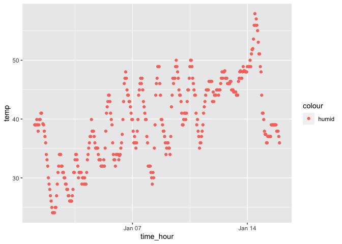

P8104 HW 1 LEL2176
================

# Problem 1

    ## ── Attaching core tidyverse packages ──────────────────────── tidyverse 2.0.0 ──
    ## ✔ dplyr     1.1.3     ✔ readr     2.1.4
    ## ✔ forcats   1.0.0     ✔ stringr   1.5.0
    ## ✔ ggplot2   3.4.3     ✔ tibble    3.2.1
    ## ✔ lubridate 1.9.2     ✔ tidyr     1.3.0
    ## ✔ purrr     1.0.2     
    ## ── Conflicts ────────────────────────────────────────── tidyverse_conflicts() ──
    ## ✖ dplyr::filter() masks stats::filter()
    ## ✖ dplyr::lag()    masks stats::lag()
    ## ℹ Use the conflicted package (<http://conflicted.r-lib.org/>) to force all conflicts to become errors

the the `early_january_weather` dataset, the most important variables
are `temp`, `dewp`, `humid`, `wind_dir`, `wind_speed`, `wind_gust`,
`precip`, `visib`, and `pressure`, which are all recorded according to
`year`, `month`, `day`, and `hour` and `time_hour`. we are able to
observe fairly consistent values for all variable with a few outliers.
there are missing values for the `wind_gust` column, and all 0 values
for the `precip` column. the temperatures seem to be in the upper 30s
and low 40s. the dewp is in the high 20s. the humid is in the upper 50s
and low 60s. wind direction is in the mid 200s and wind speed varys from
aroudn 8 to 15. the pressure stays fairly constant aroudn 1012. the rows
of the data set `nrow(early_january_data)`is 358. the columns of the
data set `ncol(early_january_data)` is 15. the mean temperature of the
data is: `mean(early_january_weather[["temp”]]` which is equal to
39.58212.

``` r
weather_scat = ggplot(early_january_weather, aes(x = time_hour, y  = temp, color = humid)) + geom_point()
weather_scat
```

<!-- -->

``` r
ggsave("weather_scat.pdf")
```

    ## Saving 7 x 5 in image

the scatter plot `weather_scat` shows the relationship between time
measure by hours and the recorded temperature. when analyzing the graph
there is a clear sinusoidal wave pattern that repeats everyday. these
waves represents the highs and lows of daily temperature with the
temperature peaking midday and dropping during the night when the sun is
gone. however, the overall trend of the line has an increasing slope
showing that the temperature is slowly increasing as the days go on.

# Problem 2

``` r
hw1_df = 
  tibble(
    x = rnorm(10),
    vec_log = c(x>0),
    vec_char = c("Child", "Adult", "Old Age", "Old Age", "Adult", "Old Age",
                 "Child", "Adult", "Adult", "Child"),
    vec_fact = factor(vec_char, levels = c("Child", "Adult", "Old Age"))
  )
```

When trying to take the mean of each variable of my data frame, I was
able to obtain a numerical answer for `x` (my random sample) and
`vec_log` (my logical vector), but not `vec_char` (my character vector)
or `vec_fact` (my factor vector). I found my mean by doing
`mean(hw1_df[[“variable_name”]])` but I also could have implemented the
`pull()` funciton in order to pull out specific variables from the
dataframe. example: `pull(hw1_df, "vec_fact")` would give me just the
factor vector from the dataframe.

``` r
num_log = as.numeric(hw1_df[["vec_log"]])
num_char = as.numeric(hw1_df[["vec_char"]])
```

    ## Warning: NAs introduced by coercion

``` r
num_fact = as.numeric(hw1_df[["vec_fact"]])
```

when using the `as.numeric` function, I am able to output the vectors
from my dataframe as numeric vectors. `as.num(hw1_df[["vec_log"]])`
outputs my logical vector as a vector of numbers, which makes sense why
I was able to calculate the mean for this vector.
`as.numeric(hw1_df[["vec_char"]])` outputs a vector of only NA values
because it was not able to convert the vector into numerical values,
which makes sense why I was not able to calculate the mean of this
vector. `as.numeric(hw1_df[["vec_fact"]])` outputs a vector with
numerical values, which does not make sense because I am not able to
calculate the mean of this vector, yet it is able to be converted into
numerical values. however, I am able to find the mean of `vec_fact`
using the newly created numerical vector: `mean(num_fact)` = 2.
